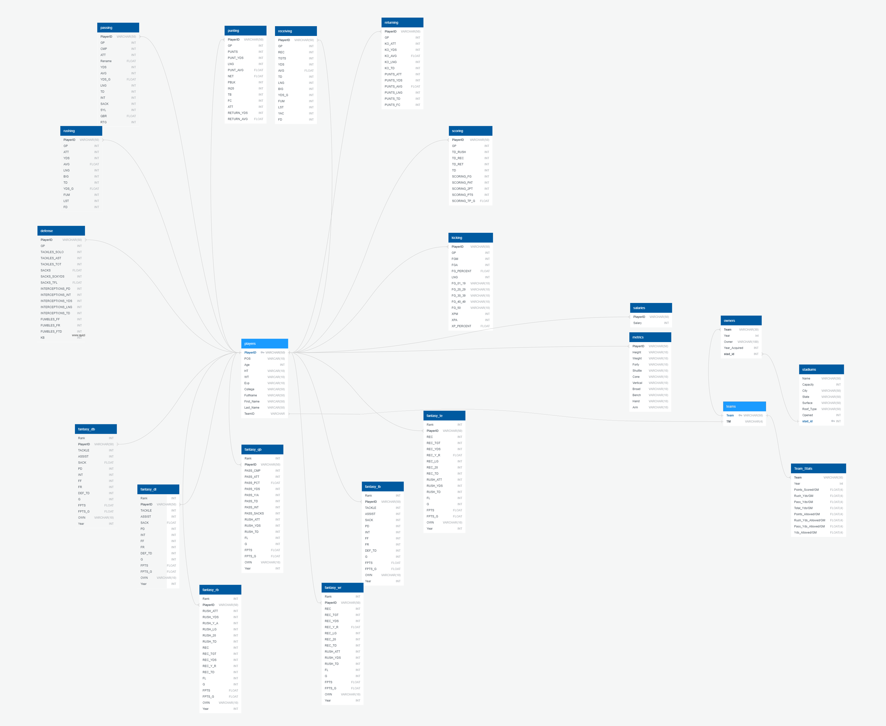

# NFL-ETL-Project 
This program will deliver a relational database with statistical information about NFL players. The information has been aggregated at the team and individual player level to allow for a variety of analyses.

The program uses 7 websites to scrape the information from the web. It produces 23 tables.

These are the steps that were taken:
* The database schema was defined as follows:

* Based on our ERD, we then predefined the database to PostgreSQL (see the individual folders for the tables they created).

* Once the database is created the ETL process can begin.

## Step 1 - Extract

### The Sources:

1. wikipedia.com
2. pro-football-reference.com
3. rotowire.com
4. msn.com
5. footballdb.com
6. espn.com
7. fantasypros.com

## Step 2 - Transform

1.) salaries:
* Remove unnecessary columns (Rank, Player, POS, Tm)
* Add column PlayerID (merged with rotowire_df, on Player).
    
2.) teams:
* Delete blank rows and set columns to Franchise and Abbreviation/Acronym.
* Rename both columns to be Team and TM.

3.) stadiums:
* Remove columns (Image, Team(s), and Ref(s)). 
* Column Location was split into seperate columns for City and State.
* Add column stad_id to create unique ID for each stadium and team association.

4.) owners: 
* Kept all the columns from the raw data
* Renamed 'Franchise' to 'Team'
* Merged Team on the stadium file for team to create a link of owners to stadiums

5.) players:
* Concatenated Offense, Defense, Special .csv files
* Split ‘Name’ into ‘FullName’, ‘First Name’, ‘Last Name’
* Renamed ‘Name’ column to ‘PlayerID’
* Added ‘TeamID’ column as Foreign Key
* Dropped ‘team’ column

6.) metrics:
* Add column PlayerID (merged with rotowire_df, on Player).
* Dropped ‘Name’ column
* Dropped 10 ‘%_Percentile’ columns
* Dropped ‘Arm Length’ and ‘Hand Length’ columns

7.) Fantasy_rb, fantasy_wr, fantasy_lb, fantasy_qb, fantasy_dl, fantasy_db, fantasy_te:
* Add column PlayerID (merged with rotowire_df, on Player).
*  Dropped ‘Player’ column
* Converted operator characters( +, /) to ‘_’ in column names
* Added Prefix to duplicate column names (ie. ‘TD’ and ‘TD’ to ‘REC_TD’ and ‘RUSH_TD’)

8.) fantasy_dst:
* Added ‘TeamID’ column as Foreign Key
* Removed ‘Player’ column (column of teams)

9.)  kicking, scoring, returning, receiving, rushing, passing, punting, defense:
* Add column PlayerID (merged with rotowire_df, on Player).
* Dropped ‘Name’ column
* Converted operator characters( +, /) to ‘_’ in middle of names and ‘‘ at the ends
* Added Prefix to duplicate column names (ie. ‘TD’ and ‘TD’ to ‘KO_TD’ and ‘PUNTS_TD’)

10.) team_stats:
* Created a list of years for data we wanted to collect
* Created a for loop to read in an offensive and defensive table for each year. This was done by utilizing read_html
* Merged the offensive and defensive tables on the Team column
* Looped through each row splitting the Team column by spaces and capitalized letters to create columns that can be used more easily
* Appended the data of interest to new lists
* Added each, new list as a column to my dataframe (city and team name)
* Also added a year column for each row of data
* Concatenated the defensive data and offensive data into one dataframe
* Renamed each column to a more descriptive one
* Dropped extra/unnecessary columns
*Reordered columns to make table easier to understand

*** See [ETL Excel](Resources/Full_Picture) file for further details
    
## Step 3 - Load

Since all the tables had been predefined in PostgreSQL, loading the data could only happen once, or else the primary keys will be violated. All data has also been loaded into a sqlite file for ease of use.

    

